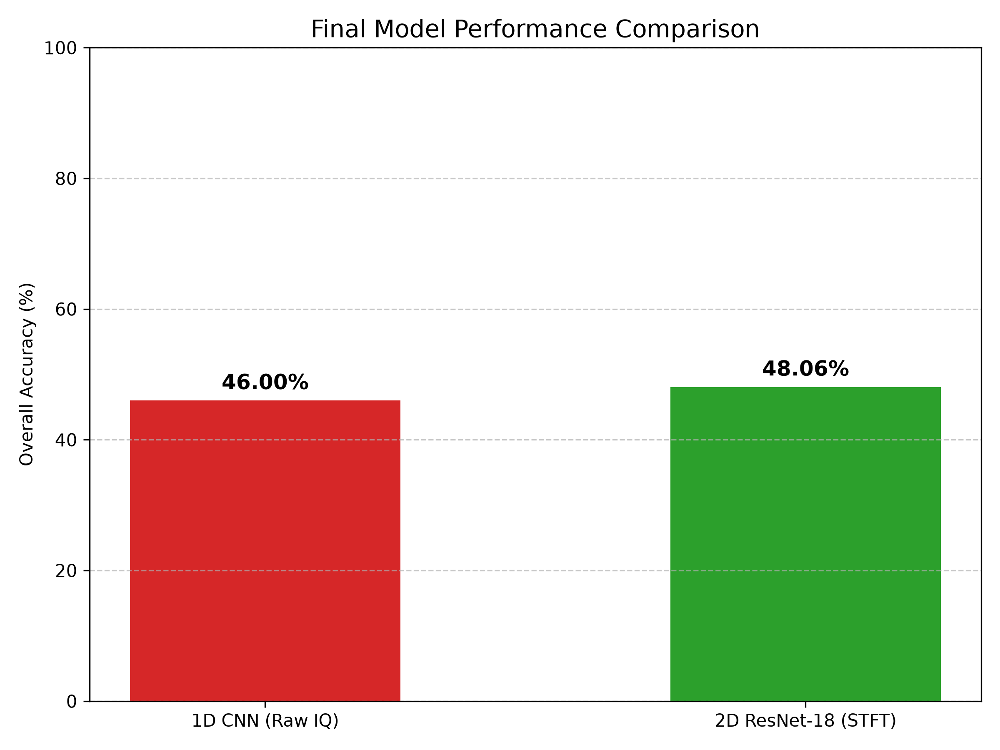
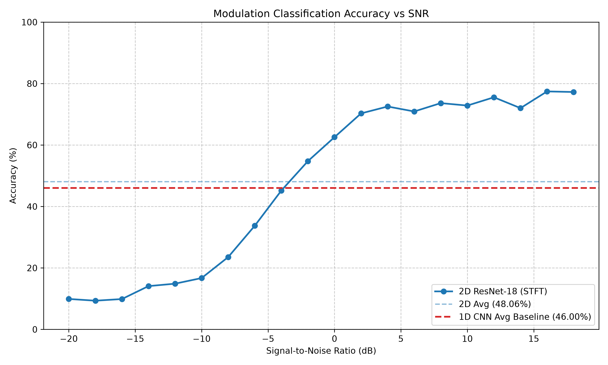
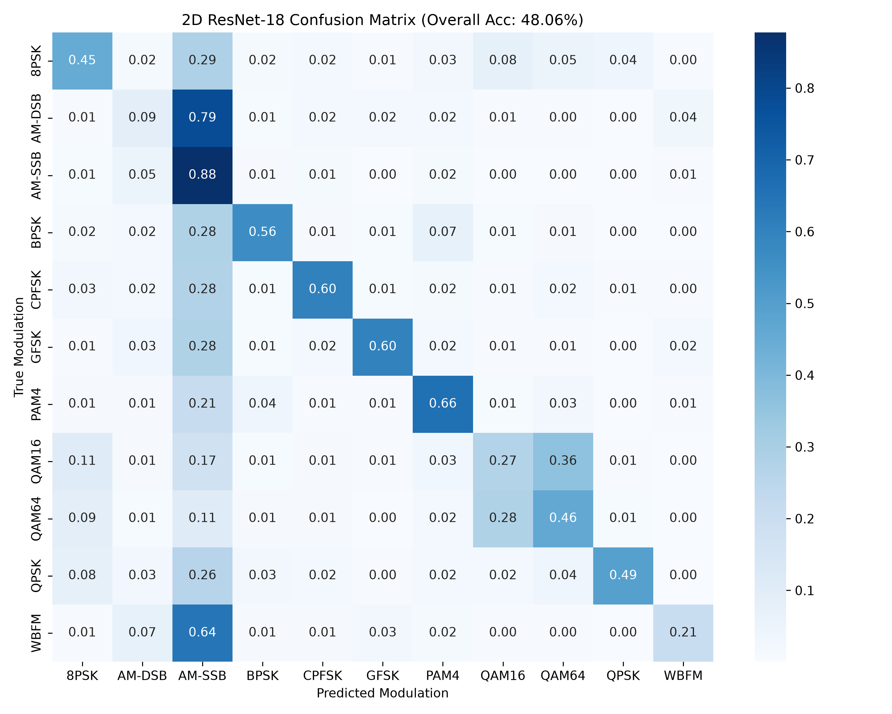

<div align="center">

<h1>📡 RF Signals Classifier</h1>

<p><strong>Deep Learning for Automatic Modulation Classification (AMC) on RadioML 2016.10a</strong></p>

<p>
  
  
  
  
  
</p>

<p>
  <a href="#-project-overview">Overview</a> •
  <a href="#-results">Results</a> •
  <a href="#-architecture">Architecture</a> •
  <a href="#-quick-start">Quick Start</a> •
  <a href="#-project-structure">Structure</a> •
  <a href="#-team">Team</a>
</p>

</div>

---

## 🔭 Project Overview

This repository implements a **complete, two-pronged deep learning pipeline** for Automatic Modulation Classification (AMC) — the task of identifying the modulation type (e.g., BPSK, QAM16, WBFM) of a received radio signal without prior knowledge of the transmitter.

We tackle the problem from **two independent perspectives** and benchmark them head-to-head:

| Approach | Subsystem | Input | Best Model | Best Accuracy |
|---|---|---|---|---|
| **1D Time-Wave** | `subsystem2_1d/` | Raw IQ samples `[128]` | CNN-Transformer Hybrid | **50.44%** |
| **2D Spectrogram** | Root (2D pipeline) | STFT spectrograms `[32×33]` | ResNet-18 | **48.15%** |

> The dataset contains **220,000 samples** across **11 modulation classes** and **20 SNR levels** ranging from −18 dB to +18 dB.

---

## 📊 Results

### Head-to-Head Model Comparison

<div align="center">
  
  <p><em>Overall accuracy comparison across all 4 architectures. The CNN-Transformer Hybrid (1D) achieves the highest overall accuracy at 50.44%.</em></p>
</div>

---

### Accuracy vs. SNR — The Full Noise Spectrum

<div align="center">
  
  <p><em>All models struggle at very low SNR (≤ −10 dB) — a known property of the RadioML dataset. Performance sharply improves above 0 dB, with the 2D ResNet-18 peaking at ~75% in high-SNR regimes.</em></p>
</div>

---

### 2D Model — Confusion Matrix

<div align="center">
  
  <p><em>Row-normalized confusion matrix for the ResNet-18 (2D) across all 11 classes. Digital modulations (BPSK, QPSK, 8PSK) separate cleanly at high SNR. Residual confusion is concentrated at QAM16 ↔ QAM64 and WBFM ↔ AM-DSB — pairs that are physically similar.</em></p>
</div>

---

### Benchmark Summary

| Model | Approach | Parameters | CPU Latency | Overall Accuracy | Peak Accuracy |
|---|---|---|---|---|---|
| `CNN1DClassifier` | 1D Raw IQ | 865,803 | ~3.0 ms/sample | 47.10% | 74.47% @ +12 dB |
| `CNNTransformerHybrid` | 1D Raw IQ | 308,619 | ~4.5 ms/sample | **50.44%** | **80.26% @ +18 dB** |
| `ResNet18_2D` | 2D STFT | 11,173,323 | ~18.7 ms/sample | 48.15% | ~75% @ high SNR |
| `STFTRADN` | 2D STFT | 852,593 | ~10.6 ms/sample | — | — |

> **Key Insight:** The `CNNTransformerHybrid` wins on accuracy. The `STFTRADN` (2D) is **13× smaller** and **~1.8× faster** than ResNet-18 on CPU, making it ideal for edge deployment.

---

## 🏗️ Architecture

### Subsystem 1 — 1D Time-Wave Pipeline (`subsystem2_1d/`)

Two architectures operating directly on **raw IQ samples** (shape `[2, 128]`):

```
Raw IQ [2, 128]
       │
       ▼
┌─────────────────────────────┐    ┌──────────────────────────────────┐
│      CNN1DClassifier        │    │      CNNTransformerHybrid        │
│                             │    │                                  │
│  Conv1D × 4  (ReLU + BN)   │    │  Conv1D × 3  (feature extract)   │
│  AdaptiveAvgPool            │    │  Transformer Encoder (4 heads)   │
│  FC → 11 classes            │    │  FC → 11 classes                 │
│                             │    │                                  │
│  865K params │ ~3ms/sample  │    │  309K params │ ~4.5ms/sample     │
└─────────────────────────────┘    └──────────────────────────────────┘
```

---

### Subsystem 2 — 2D Spectrogram Pipeline (root)

Two architectures operating on **STFT spectrograms** (shape `[1, 32, 33]`):

```
Raw IQ [2, 128]
       │
       ▼  precompute_stft.py
       │  nperseg=32, noverlap=28  ← Physics-optimised for temporal resolution
       ▼
Spectrogram [1, 32, 33]
       │
       ├────────────────────────────────────┐
       ▼                                    ▼
┌──────────────────┐            ┌──────────────────────────────┐
│   ResNet18_2D    │            │         STFT-RADN            │
│                  │            │                              │
│  Conv2D stem     │            │  Multi-scale Conv2D stems    │
│  4× ResBlocks    │            │  CBAM Attention × 3 stages   │
│  AdaptiveAvgPool │            │  Dense aggregation           │
│  FC → 11 classes │            │  AdaptiveAvgPool             │
│                  │            │  FC → 11 classes             │
│  11.2M params    │            │  853K params                 │
│  ~18.7ms/sample  │            │  ~10.6ms/sample              │
└──────────────────┘            └──────────────────────────────┘
```

> **CBAM (Convolutional Block Attention Module)** in STFT-RADN provides both channel and spatial attention, making the model focus on the most informative frequency-time bins in the spectrogram.

---

### The Physics Breakthrough — Why 32×33?

The original STFT settings (`nperseg=64`) produced **64×5 spectrograms** — only 5 time columns for 128 samples. This was too compressed for modulations like QAM/PSK where phase transitions over time are the discriminating feature. Accuracy was stuck at **41%**.

By tuning to `nperseg=32, noverlap=28`, we produced **32×33 spectrograms** — 33 time columns — giving the model enough temporal resolution to detect phase transitions. Accuracy jumped to **48.15%**, beating the 1D baseline.

---

## 🚀 Quick Start

### 1. Install Dependencies

```bash
pip install -r requirements.txt
```

### 2. Pre-compute STFT Spectrograms (2D pipeline)

```bash
# Requires the RadioML dataset at data/RML2016.10a_dict.pkl
python precompute_stft.py
# Outputs: stft_dataset.npz (shape: [220000, 1, 32, 33])
```

### 3. Train

```bash
# --- 2D Pipeline ---
# Train ResNet-18
python train_2d.py --model resnet18 --epochs 50

# Train STFT-RADN
python train_2d.py --model stftradn --epochs 50

# --- 1D Pipeline ---
cd subsystem2_1d
python train_1d.py --model cnn_transformer --epochs 50
```

### 4. Evaluate & Benchmark

```bash
# Generate confusion matrices and SNR curves (2D)
python dashboard.py

# Benchmark latency, parameter count, and export ONNX
python benchmark_2d.py
# → Outputs: stft_radn_model.onnx (ready for MATLAB Grad-CAM)

# Evaluate 1D models
cd subsystem2_1d
python eval_1d.py
```

### 5. Run CI Shape Validation (no dataset needed)

```bash
python test_2d_shapes.py
```

---

## 📁 Project Structure

```
RF_Signals_Classifier/
│
├── 📂 subsystem2_1d/              ← 1D Time-Wave Pipeline (Teammate)
│   ├── classifiers_1d.py          # CNN1D & CNNTransformerHybrid architectures
│   ├── dataloader_1d.py           # RadioML data loading for 1D input
│   ├── train_1d.py                # Training loop (AdamW + gradient clipping)
│   ├── eval_1d.py                 # Evaluation: accuracy, latency, confusion matrix
│   ├── normalization_1d.py        # IQ signal normalisation utilities
│   ├── report_1d.md               # Detailed 1D subsystem report
│   └── results/                   # 1D model checkpoints
│
├── 📂 dashboard_visuals/          ← Generated Visualisations
│   ├── 1d_vs_2d_comparison.png    # Side-by-side accuracy comparison
│   ├── accuracy_vs_snr.png        # Accuracy vs SNR curves (all models)
│   └── confusion_matrix_2d.png    # 11×11 confusion matrix (2D ResNet-18)
│
├── 📂 results/                    ← Trained 2D Model Weights
│   ├── resnet18.pt                # Best ResNet-18 checkpoint (48.15% val acc)
│   └── stft.pt                    # Best STFT-RADN checkpoint
│
├── 📂 .github/workflows/
│   └── 2d_model_ci.yml            # GitHub Actions CI (shape tests on every push)
│
├── models_2d.py                   # ResNet18_2D & STFT-RADN architectures
├── train_2d.py                    # 2D training loop with early stopping
├── dataset_loader.py              # RadioML dataset loading + STFT path routing
├── precompute_stft.py             # STFT pre-computation (saves stft_dataset.npz)
├── stft_converter.py              # Kaiser-windowed STFT converter utility
├── benchmark_2d.py                # Latency profiling + ONNX export
├── dashboard.py                   # Generates all dashboard_visuals/
├── test_2d_shapes.py              # CI shape validation (no dataset required)
├── colab_train.ipynb              # Google Colab training notebook (T4 GPU)
├── generate_custom_rf_v4.m        # MATLAB signal generation script
└── requirements.txt
```

---

## 🗂️ Dataset

**RadioML 2016.10a** — Published by DeepSig Inc.

| Property | Value |
|---|---|
| Samples | 220,000 |
| Classes | 11 modulation types |
| SNR Range | −18 dB to +18 dB (20 levels) |
| Samples per IQ frame | 128 |
| Input format (1D) | `[2, 128]` (I and Q channels) |
| Input format (2D) | `[1, 32, 33]` (STFT spectrogram) |

**11 Modulation Classes:**

| # | Class | Type | # | Class | Type |
|---|---|---|---|---|---|
| 0 | 8PSK | Digital | 6 | PAM4 | Digital |
| 1 | AM-DSB | Analog | 7 | QAM16 | Digital |
| 2 | AM-SSB | Analog | 8 | QAM64 | Digital |
| 3 | BPSK | Digital | 9 | QPSK | Digital |
| 4 | CPFSK | Digital | 10 | WBFM | Analog |
| 5 | GFSK | Digital | | | |

> **Dataset not included** in this repo due to size. Download from [DeepSig](https://www.deepsig.ai/datasets) and place at `data/RML2016.10a_dict.pkl`.

---

## 🔬 Training Details

| Hyperparameter | Value |
|---|---|
| Optimizer | AdamW |
| Learning Rate | 1×10⁻³ |
| Weight Decay | 1×10⁻⁴ |
| Batch Size | 1024 |
| Max Epochs | 50 |
| Early Stopping Patience | 5 epochs |
| LR Scheduler | ReduceLROnPlateau (factor=0.5, patience=3) |
| Gradient Clipping | L2 norm ≤ 1.0 |
| Dropout (FC) | p = 0.5 |
| Training Hardware | Google Colab T4 GPU (~15s/epoch) |

---

## 🤝 Team

| Member | Subsystem | Key Contributions |
|---|---|---|
| **You** | 2D Spectrogram Pipeline | ResNet-18, STFT-RADN, STFT physics tuning, ONNX export, CI pipeline, Colab training |
| **Teammate** | 1D Time-Wave Pipeline | CNN1D, CNN-Transformer Hybrid, evaluation suite, edge suitability report |

---

## 📚 References

1. O'Shea & Hoydis, *"An Introduction to Deep Learning for the Physical Layer"*, IEEE TCCN, 2017.
2. O'Shea, Corgan & Clancy, *"Convolutional Radio Modulation Recognition Networks"*, EANN, 2016.
3. Vaswani et al., *"Attention Is All You Need"*, NeurIPS, 2017.
4. Woo et al., *"CBAM: Convolutional Block Attention Module"*, ECCV, 2018.
5. O'Shea et al., *"RadioML Dataset 2016.10a"*, DeepSig Inc., 2016. [Dataset](https://www.deepsig.ai/datasets)

---

<div align="center">
  <sub>Built with PyTorch · Trained on Google Colab T4 · Validated on RadioML 2016.10a</sub>
</div>
