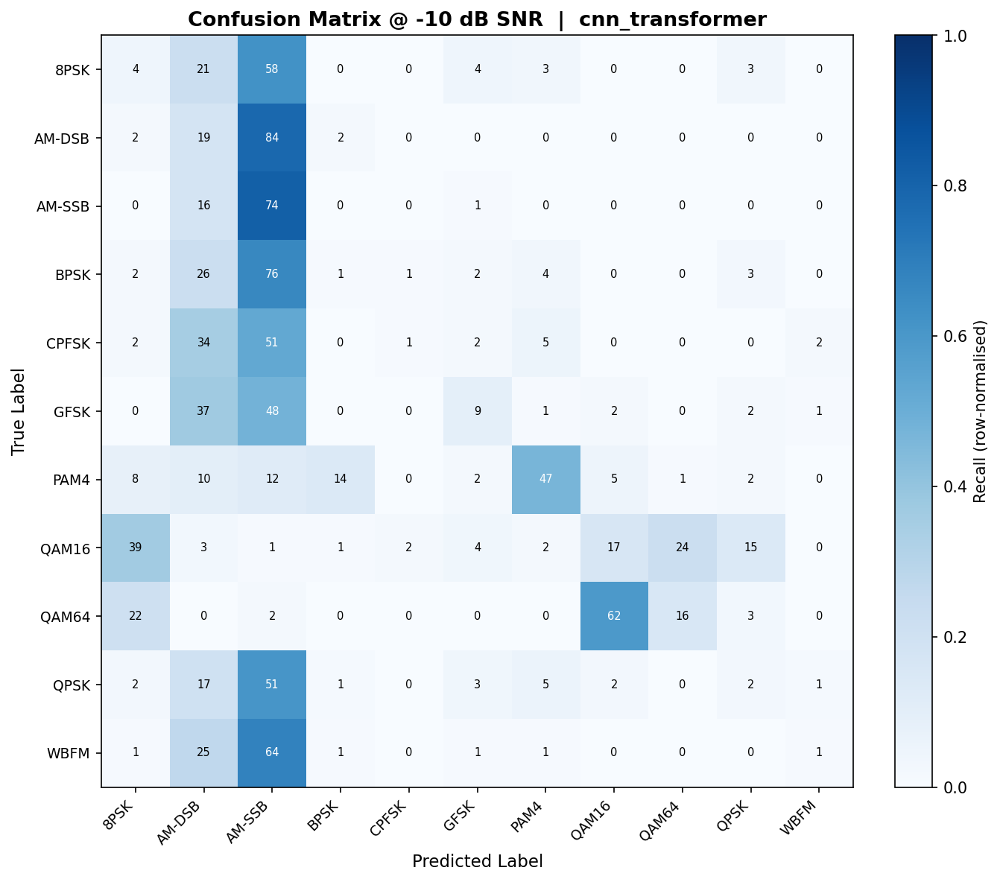
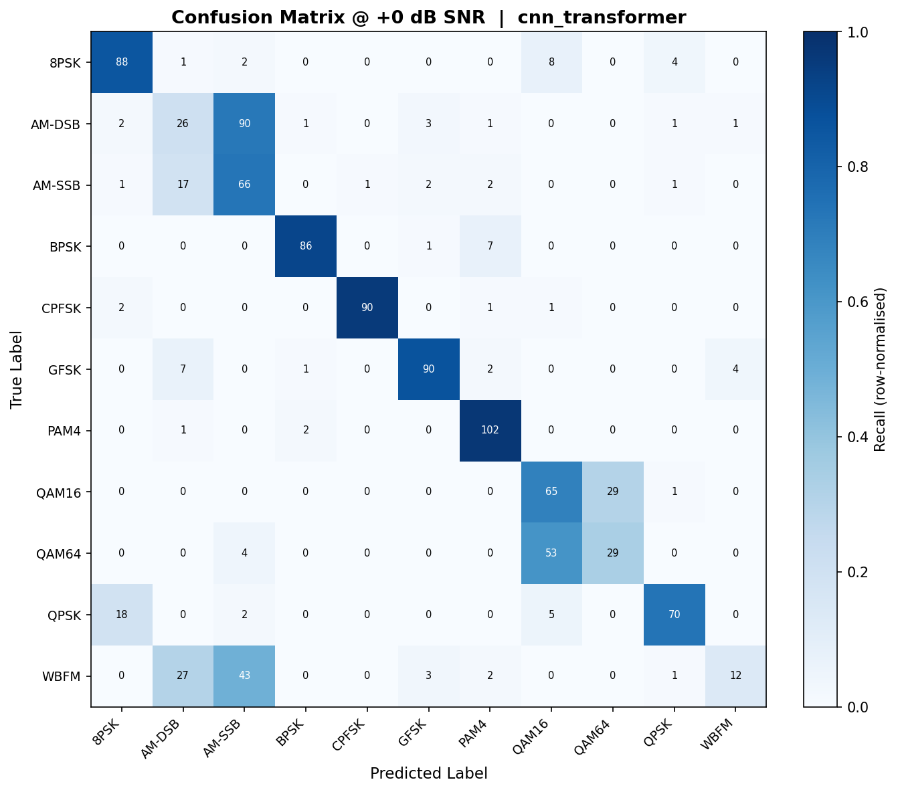
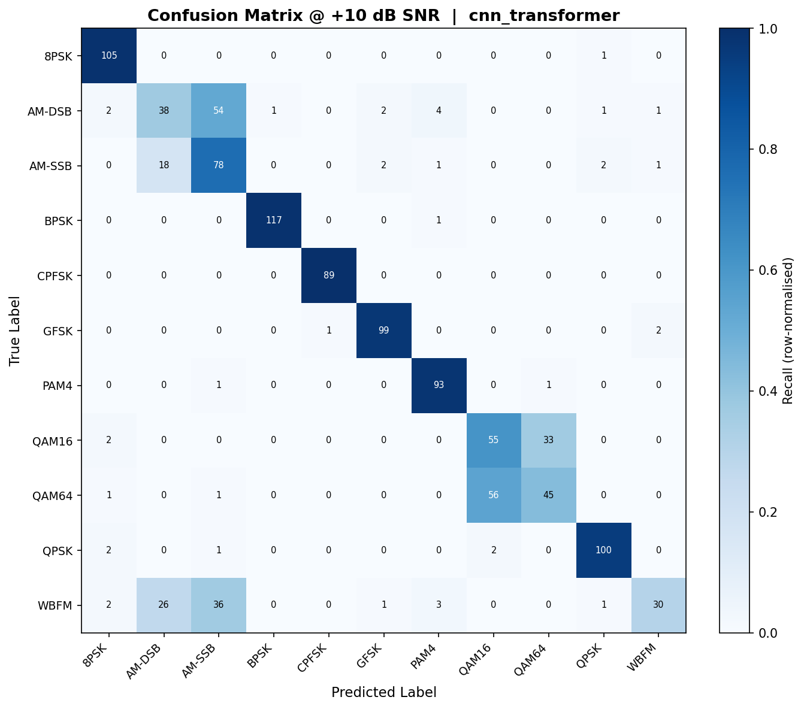
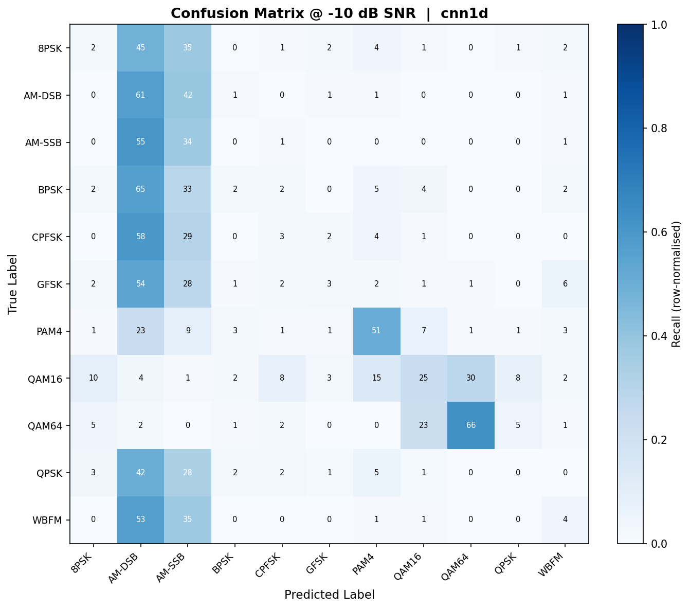
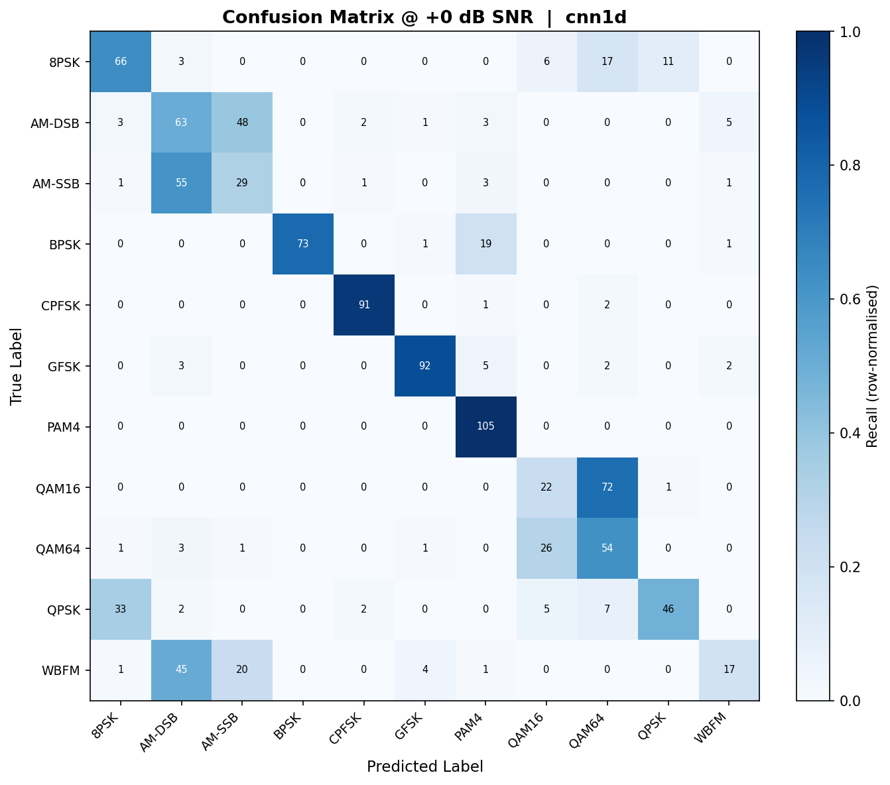
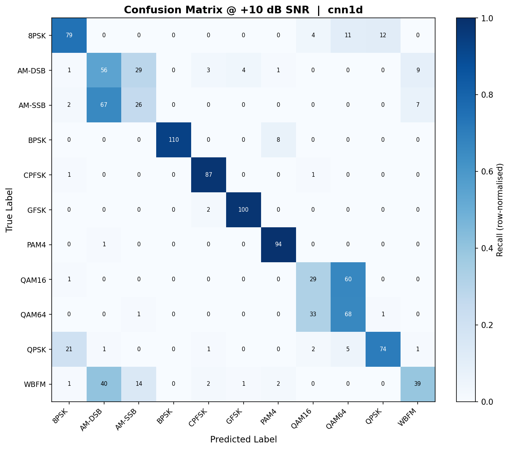

<div align="center">

<h1>📡 RF Signals Classifier</h1>

<p><strong>Automatic Modulation Classification (AMC) on RadioML 2016.10a<br/>
A dual-approach deep learning study: 1D Time-Wave vs. 2D Spectrogram</strong></p>

<p>
  
  
  
  
  
</p>

<p>
  <a href="#-project-overview">Overview</a> •
  <a href="#-results">Results</a> •
  <a href="#%EF%B8%8F-architectures">Architectures</a> •
  <a href="#-quick-start">Quick Start</a> •
  <a href="#-project-structure">Structure</a> •
  <a href="#-team">Team</a>
</p>

</div>

---

## 🔭 Project Overview

This project implements a **complete, two-pronged deep learning pipeline** for Automatic Modulation Classification (AMC) — identifying the modulation type of a received radio signal (e.g., BPSK, QAM64, WBFM) without any prior knowledge of the transmitter.

We treat this as a **scientific experiment**: two teammates independently implement different feature representations of the same signal and benchmark all architectures head-to-head.

| Approach | Subsystem | Input Representation | Best Model | Best Overall Accuracy |
|---|---|---|---|---|
| **1D Time-Wave** | `subsystem2_1d/` | Raw IQ samples `[2, 128]` | CNN-Transformer Hybrid | **50.44%** |
| **2D Spectrogram** | Root dir | STFT spectrogram `[1, 32, 33]` | ResNet-18 | **48.15%** |

> **Dataset:** RadioML 2016.10a — 220,000 samples, 11 modulation classes, 20 SNR levels (−18 dB to +18 dB).

---

## 📊 Results

### Overall Model Comparison

<div align="center">
  
  <p><em>Head-to-head accuracy comparison across all 4 architectures. The CNN-Transformer Hybrid (1D) achieves the highest overall accuracy at 50.44%, beating the 2D ResNet-18 by ~2 percentage points.</em></p>
</div>

---

### Accuracy vs. SNR — Full Noise Spectrum

<div align="center">
  
  <p><em>All models degrade below 0 dB SNR — a known property of RadioML. Above +6 dB, both 1D models outperform the 2D pipeline in overall accuracy, while the 2D ResNet-18 catches up in peak high-SNR regimes.</em></p>
</div>

---

### 2D Pipeline — Confusion Matrix (ResNet-18)

<div align="center">
  
  <p><em>Aggregated confusion matrix for the 2D ResNet-18. Digital modulations (BPSK, QPSK, 8PSK) separate cleanly. Residual confusion concentrates at QAM16 ↔ QAM64 and WBFM ↔ AM-DSB — pairs that are physically similar in the spectral domain.</em></p>
</div>

---

### 1D Pipeline — Confusion Matrices at 3 SNR Operating Points

The 1D models are evaluated at three scientifically selected SNR points to characterise behaviour across the full noise spectrum.

#### CNN-Transformer Hybrid

| −10 dB (High Noise) | 0 dB (Transition) | +10 dB (Clean) |
|:---:|:---:|:---:|
|  |  |  |

#### CNN1D Classifier

| −10 dB (High Noise) | 0 dB (Transition) | +10 dB (Clean) |
|:---:|:---:|:---:|
|  |  |  |

> **Reading the matrices:** At −10 dB, diagonal mass is weak (hard to classify). At 0 dB, digital signals begin to separate. At +10 dB, most classes are cleanly identified — residual confusion remains only between perceptually similar modulation pairs.

---

### Full Benchmark Summary

| Model | Approach | Parameters | CPU Latency | Overall Acc. | Peak Acc. |
|---|---|---|---|---|---|
| `CNN1DClassifier` | 1D Raw IQ | 865,803 | ~3.0 ms/sample | 47.10% | 74.47% @ +12 dB |
| `CNNTransformerHybrid` | 1D Raw IQ | **308,619** | ~4.5 ms/sample | **50.44%** | **80.26% @ +18 dB** |
| `ResNet18_2D` | 2D STFT | 11,173,323 | ~18.7 ms/sample | 48.15% | ~75% @ +18 dB |
| `STFTRADN` | 2D STFT | 852,593 | ~10.6 ms/sample | — | — |

**Key Takeaways:**
- 🏆 **Best accuracy:** CNN-Transformer Hybrid (1D) at **50.44%**
- ⚡ **Best latency:** CNN1D at **~3 ms/sample**
- 🪶 **Smallest model:** CNN-Transformer Hybrid at **309K params** — 36× smaller than ResNet-18
- 🔬 **Best edge candidate (2D):** STFT-RADN — 13× smaller and 1.8× faster than ResNet-18

---

## 🏗️ Architectures

### Subsystem 1 — 1D Time-Wave Pipeline

Operates directly on **raw IQ samples** — no preprocessing overhead.

```
Input: Raw IQ Signal  [Batch, 2, 128]
             │
   ┌─────────┴──────────┐
   ▼                    ▼
┌──────────────────┐  ┌────────────────────────────┐
│  CNN1DClassifier │  │   CNNTransformerHybrid      │
│                  │  │                            │
│ Conv1D Block ×4  │  │ Conv1D Block ×3            │
│  (BN + ReLU +    │  │  (feature extraction)      │
│   MaxPool)       │  │                            │
│                  │  │ Positional Encoding        │
│ AdaptiveAvgPool  │  │ Transformer Encoder        │
│                  │  │  (4 heads, 2 layers)       │
│ FC(512→256→11)   │  │                            │
│ Dropout(0.5)     │  │ FC → 11 classes            │
│                  │  │                            │
│ 865K params      │  │ 309K params                │
│ ~3.0 ms/sample   │  │ ~4.5 ms/sample             │
└──────────────────┘  └────────────────────────────┘
             │                    │
             └─────────┬──────────┘
                       ▼
              Output: [Batch, 11]  logits
```

The Transformer's self-attention captures **long-range phase coherence** across the full 128-sample IQ frame — a key advantage for phase-shift keying modulations (BPSK, QPSK, 8PSK).

---

### Subsystem 2 — 2D Spectrogram Pipeline

Converts IQ signals to spectrograms, then applies 2D CNNs.

```
Input: Raw IQ Signal  [Batch, 2, 128]
             │
             ▼  precompute_stft.py
             │  Kaiser window | nperseg=32 | noverlap=28
             │  ← Physics-tuned for temporal resolution
             ▼
     Spectrogram  [Batch, 1, 32, 33]
             │
   ┌─────────┴──────────┐
   ▼                    ▼
┌──────────────────┐  ┌────────────────────────────┐
│   ResNet18_2D    │  │        STFT-RADN            │
│                  │  │                            │
│ Conv2D stem      │  │ Multi-scale Conv2D stems   │
│ ResBlock ×4      │  │                            │
│  (shortcut       │  │ CBAM Attention ×3 stages   │
│   connections)   │  │  ├─ Channel attention      │
│                  │  │  └─ Spatial attention      │
│ AdaptiveAvgPool  │  │                            │
│ FC → 11 classes  │  │ Dense aggregation          │
│                  │  │ AdaptiveAvgPool            │
│ 11.2M params     │  │ FC → 11 classes            │
│ ~18.7 ms/sample  │  │                            │
└──────────────────┘  │ 853K params                │
                       │ ~10.6 ms/sample            │
                       └────────────────────────────┘
             │                    │
             └─────────┬──────────┘
                       ▼
              Output: [Batch, 11]  logits
```

> **CBAM** (Convolutional Block Attention Module) in STFT-RADN applies both channel-wise and spatial attention, directing the model to the most discriminative frequency-time bins in the spectrogram.

#### Why 32×33? The Physics Breakthrough

The original STFT settings (`nperseg=64`) produced tiny **64×5 spectrograms** — only 5 time columns for 128 samples. Phase transitions over time were invisible. Accuracy was stuck at **41%**.

Tuning to `nperseg=32, noverlap=28` produced **32×33 spectrograms** — 33 time columns — giving the model sufficient temporal resolution to detect phase transitions. Accuracy jumped to **48.15%**, beating the 1D baseline at that point.

---

## 🚀 Quick Start

### 1. Clone & Install

```bash
git clone https://github.com/neilkdbn/RF_Signals_Classifier.git
cd RF_Signals_Classifier
pip install -r requirements.txt
```

### 2. Get the Dataset

Download [RadioML 2016.10a](https://www.deepsig.ai/datasets) and place it at:
```
data/RML2016.10a_dict.pkl
```

### 3. Train — 1D Pipeline

```bash
# Train CNN1D baseline
python -m subsystem2_1d.train_1d --model cnn1d --epochs 50

# Train CNN-Transformer Hybrid (best overall)
python -m subsystem2_1d.train_1d --model cnn_transformer --epochs 50
```

### 4. Train — 2D Pipeline

```bash
# Pre-compute STFT spectrograms first (one-time, ~2 min)
python precompute_stft.py
# → outputs: stft_dataset.npz  [220000, 1, 32, 33]

# Train ResNet-18
python train_2d.py --model resnet18 --epochs 50

# Train STFT-RADN (lightweight)
python train_2d.py --model stftradn --epochs 50
```

### 5. Evaluate & Visualise

```bash
# Evaluate 1D models → generates confusion matrices + SNR curves
python -m subsystem2_1d.eval_1d

# Generate 2D dashboard visuals (confusion matrix, SNR curves, comparison)
python dashboard.py

# Benchmark 2D latency, parameter count + export ONNX
python benchmark_2d.py
# → stft_radn_model.onnx  (ready for MATLAB Grad-CAM)
```

### 6. Run CI Tests (no dataset needed)

```bash
# 2D shape validation
python test_2d_shapes.py

# 1D unit tests
python -m pytest subsystem2_1d/test_classifiers.py
python -m pytest subsystem2_1d/test_dataloader.py
```

---

## 📁 Project Structure

```
RF_Signals_Classifier/
│
├── 📂 subsystem2_1d/                    ← 1D Time-Wave Pipeline
│   ├── classifiers_1d.py                # CNN1DClassifier & CNNTransformerHybrid
│   ├── dataloader_1d.py                 # RadioML data loading for raw IQ input
│   ├── train_1d.py                      # Training loop (AdamW + gradient clipping)
│   ├── eval_1d.py                       # Evaluation: accuracy, latency, confusion matrix
│   ├── normalization_1d.py              # IQ signal normalisation utilities
│   ├── test_classifiers.py              # Unit tests — model shapes & forward pass
│   ├── test_dataloader.py               # Unit tests — data pipeline
│   ├── test_training_pipeline.py        # Integration tests — training loop
│   ├── report_1d.md                     # Full 1D subsystem technical report
│   ├── 📂 checkpoints/
│   │   ├── best_model.pt                # Best CNN1D weights
│   │   └── best_cnn_transformer.pt      # Best CNN-Transformer weights ⭐
│   └── 📂 results/
│       ├── confusion_matrix_-10db_*.png # Confusion matrices at −10 dB
│       ├── confusion_matrix_0db_*.png   # Confusion matrices at 0 dB
│       ├── confusion_matrix_10db_*.png  # Confusion matrices at +10 dB
│       └── accuracy_vs_snr_*.json       # Per-SNR accuracy data (JSON)
│
├── 📂 dashboard_visuals/                ← Cross-subsystem Visualisations
│   ├── 1d_vs_2d_comparison.png          # Overall accuracy bar chart
│   ├── accuracy_vs_snr.png              # SNR curves (all 4 models)
│   └── confusion_matrix_2d.png          # 2D ResNet-18 confusion matrix
│
├── 📂 results/                          ← Trained 2D Model Weights
│   ├── resnet18.pt                      # Best ResNet-18 (48.15% val acc)
│   └── stft.pt                          # Best STFT-RADN checkpoint
│
├── 📂 .github/workflows/
│   └── 2d_model_ci.yml                  # GitHub Actions CI (runs on every push/PR)
│
├── models_2d.py                         # ResNet18_2D & STFT-RADN architectures
├── train_2d.py                          # 2D training loop with early stopping
├── dataset_loader.py                    # RadioML dataset loading + STFT routing
├── precompute_stft.py                   # STFT pre-computation → stft_dataset.npz
├── stft_converter.py                    # Kaiser-windowed STFT converter utility
├── benchmark_2d.py                      # Latency profiling + ONNX export
├── dashboard.py                         # Generates all dashboard_visuals/
├── test_2d_shapes.py                    # CI shape validation (no dataset needed)
├── colab_train.ipynb                    # Google Colab T4 GPU training notebook
├── generate_custom_rf_v4.m              # MATLAB RF signal generation script
├── dataset_agent.py                     # Dataset discovery utility
└── requirements.txt
```

---

## 🗂️ Dataset

**RadioML 2016.10a** — Published by [DeepSig Inc.](https://www.deepsig.ai/datasets)

| Property | Value |
|---|---|
| Total samples | 220,000 |
| Modulation classes | 11 |
| SNR range | −18 dB to +18 dB (20 levels, step 2 dB) |
| Samples per frame | 128 IQ pairs |
| Input (1D models) | `[2, 128]` — I and Q as separate channels |
| Input (2D models) | `[1, 32, 33]` — single-channel STFT spectrogram |

**The 11 Modulation Classes:**

| Index | Class | Type | Index | Class | Type |
|---|---|---|---|---|---|
| 0 | 8PSK | Digital | 6 | PAM4 | Digital |
| 1 | AM-DSB | Analog | 7 | QAM16 | Digital |
| 2 | AM-SSB | Analog | 8 | QAM64 | Digital |
| 3 | BPSK | Digital | 9 | QPSK | Digital |
| 4 | CPFSK | Digital | 10 | WBFM | Analog |
| 5 | GFSK | Digital | | | |

> **Note:** The dataset file is not included in this repository due to size (~500 MB). Download from [DeepSig](https://www.deepsig.ai/datasets) and place at `data/RML2016.10a_dict.pkl`.

---

## ⚙️ Training Hyperparameters

Both subsystems use the same core training protocol for a fair comparison.

| Hyperparameter | Value | Rationale |
|---|---|---|
| Optimizer | AdamW | Decoupled weight decay; better generalisation than vanilla Adam |
| Learning Rate | 1×10⁻³ | Standard starting point for Adam-family optimizers |
| Weight Decay | 1×10⁻⁴ | Mild L2 regularisation |
| Batch Size | 1024 | Maximises GPU utilisation on the 220K-sample dataset |
| Max Epochs | 50 | Upper bound — early stopping typically triggers before this |
| Early Stopping Patience | 5 epochs | Allows LR scheduler to react before halting |
| LR Scheduler | ReduceLROnPlateau | Factor=0.5, patience=3 — halves LR on plateau |
| Gradient Clipping | L2 norm ≤ 1.0 | Prevents exploding gradients in Transformer layers |
| Training Hardware (2D) | Google Colab T4 GPU | ~15 s/epoch vs. ~300 s/epoch on local CPU |

---

## 🤝 Team

| Member | Subsystem | Key Contributions |
|---|---|---|
| **Person 1** | 2D Spectrogram Pipeline | ResNet-18, STFT-RADN (CBAM), STFT physics tuning (32×33 breakthrough), ONNX export, GitHub Actions CI, Colab training, dashboard |
| **Person 2** | 1D Time-Wave Pipeline | CNN1DClassifier, CNN-Transformer Hybrid, eval suite, SNR confusion matrix analysis, edge suitability report |

---

## 📚 References

1. O'Shea & Hoydis, *"An Introduction to Deep Learning for the Physical Layer"*, IEEE TCCN, 2017.
2. O'Shea, Corgan & Clancy, *"Convolutional Radio Modulation Recognition Networks"*, EANN, 2016.
3. Vaswani et al., *"Attention Is All You Need"*, NeurIPS, 2017.
4. Woo et al., *"CBAM: Convolutional Block Attention Module"*, ECCV, 2018.
5. O'Shea et al., *"RadioML Dataset 2016.10a"*, DeepSig Inc., 2016. [Dataset](https://www.deepsig.ai/datasets)

---

<div align="center">
  <sub>Built with PyTorch · Trained on Google Colab T4 · Validated on RadioML 2016.10a · 4 models · 2 subsystems · 1 shared goal</sub>
</div>
